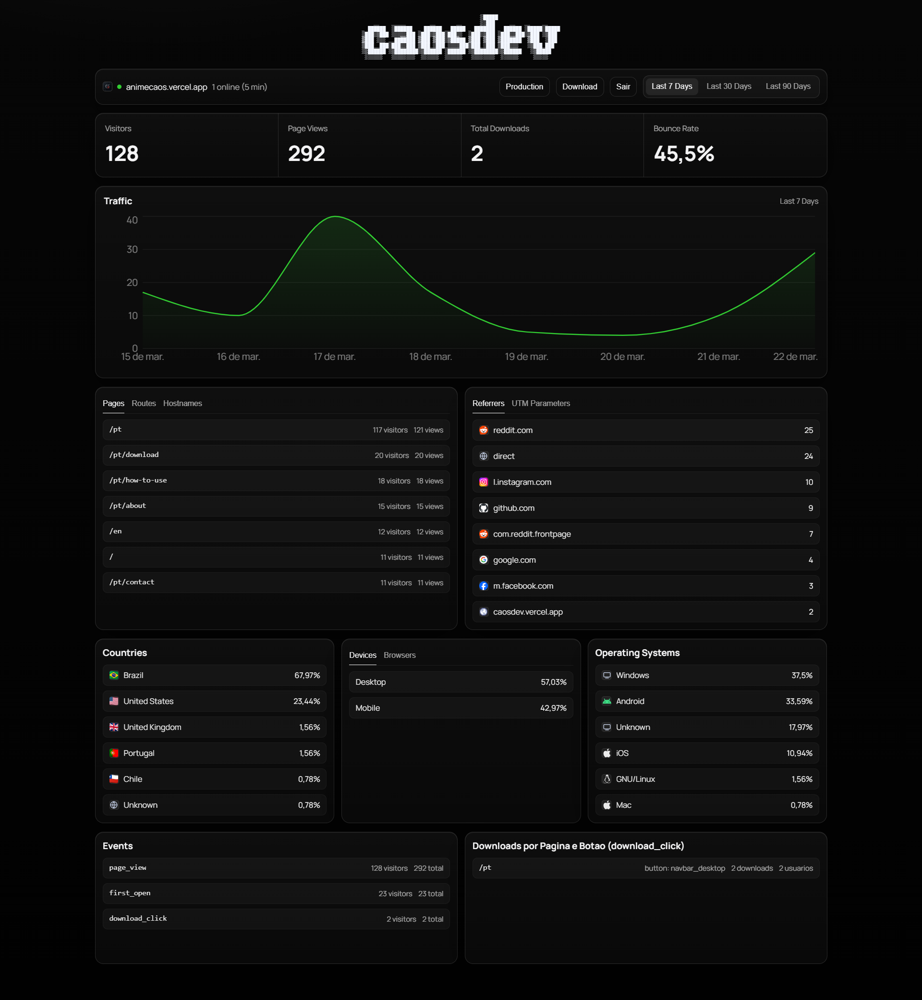

# AnimeCaos Analytics Platform

Este repositório reúne dois produtos que trabalham juntos em produção:

- uma **frontpage/landing page** voltada para aquisição e distribuição do app;
- um **dashboard de analytics first-party** com API própria de ingestão e visualização.

A proposta técnica foi simples desde o início: medir comportamento real de uso sem depender de Google Analytics/Firebase, mantendo controle da coleta, da retenção e da forma como os dados entram no produto.

## Visão Geral

O fluxo principal funciona assim:

1. A frontpage captura eventos de navegação e conversão no cliente.
2. Esses eventos passam por um proxy seguro no servidor da landing (`/api/track`).
3. O proxy encaminha os dados para a API de ingestão do dashboard (`/api/v1/events`).
4. O dashboard normaliza, armazena em formato append-only (`NDJSON`) e consolida métricas.
5. As rotas de métricas exigem sessão autenticada para consulta.

Na prática, isso entrega um pipeline first-party completo, com baixa complexidade operacional e boa auditabilidade.

## Preview do Projeto

### Landing Page


### Dashboard de Analytics



## Estrutura do Repositório

```text
.
├── frontpage/                    # landing page (marketing + tracking client/proxy)
├── dashboard/                    # API de analytics + dashboard autenticada
└── archive/analytics-first-party # snapshot histórico de versão anterior
```

## Stacks e Bibliotecas

### Frontpage (landing)

- **Next.js 16** + **React 19** + **TypeScript**
- **next-intl** (conteúdo PT/EN)
- **next-sitemap** (SEO técnico)
- **framer-motion**, **gsap**, **three** (camada visual/animações)
- **lucide-react** (ícones)

### Dashboard (analytics)

- **Next.js 15** + **React 19** + **TypeScript**
- **zod** (validação de payloads)
- **recharts** (visualização de métricas)
- **framer-motion** (interações da UI)
- Persistência first-party em arquivo **NDJSON** (append-only)

## Frontpage: O Que Ela Faz

A frontpage não é só vitrine. Ela também é a primeira camada de telemetria:

- rastreia `page_view`, `download_click`, `first_open` e `pwa_installed`;
- gera `visitorId` (persistido em `localStorage`) e `sessionId` (persistido em `sessionStorage`);
- usa `sendBeacon` quando possível e faz fallback para `fetch` com `keepalive`;
- envia os eventos para `/api/track`, sem expor a chave de escrita para o cliente.

Também há suporte real de SEO e localização:

- conteúdo em português e inglês;
- metadados por locale;
- JSON-LD de organização e navegação;
- sitemap e robots configurados.

## Dashboard: Lógica de Negócio e Métricas

O dashboard foi organizado em camadas (domínio, aplicação, infraestrutura e interface HTTP), o que ajudou a manter regras de negócio separadas da entrega web.

Principais capacidades:

- ingestão de eventos via `/api/v1/events`;
- métricas agregadas (`overview`, `timeseries`, `funnel`, `page-funnel`, `top-pages`, `explorer`);
- exportação CSV por blocos;
- baseline opcional para combinar histórico externo (`vercel-baseline.json`) com eventos recentes.

O repositório de eventos:

- grava cada evento em uma linha JSON (append-only);
- carrega e normaliza eventos na leitura;
- exclui tráfego marcado como bot da visão analítica;
- consolida indicadores como visitantes únicos, pageviews, CTR, funil e distribuição por origem/dispositivo/país.

## Segurança Aplicada (Prática)

Não é uma seção “de checklist”; são controles implementados no código e em uso:

- autenticação do dashboard por usuário/senha com hash **scrypt**;
- sessão em cookie **HttpOnly**, `SameSite=Lax`, TTL configurável;
- conteúdo de sessão protegido com **AES-256-GCM**;
- comparação de chave de ingestão com `timingSafeEqual`;
- validação de origem (`same-origin` / allowlist) em operações sensíveis;
- rate limit em login e ingestão, com limites diferentes para humano e bot;
- heurística de bot na landing e no dashboard para reduzir poluição de métricas;
- nenhuma dependência de trackers third-party para capturar eventos principais.

Observação importante:

- o rate limit atual é em memória de processo (simples e eficiente para a fase atual);
- em ambiente multi-instância, o próximo passo natural é mover esse controle para Redis/Upstash.

## Captura de Eventos e Tratamento de Dados

O pipeline prioriza consistência antes de volume:

- validação de schema com `zod`;
- sanitização de `metadata` (limites de profundidade, quantidade de chaves e tamanho);
- limites de tamanho para `path`, `referrer` e campos textuais;
- derivação de `visitorId` quando necessário com hash e salt de servidor;
- uso de cabeçalhos de edge/proxy para enriquecer contexto (país, user-agent, origem).

Sobre dados sensíveis:

- o modelo não persiste IP em campo explícito do evento;
- IP é usado em tempo de requisição para proteção (rate limit/derivação de identidade), não como métrica de produto.

## Endpoints Principais

### Frontpage

- `POST /api/track`  
  Proxy seguro da landing para a API do dashboard.

### Dashboard

- `POST /api/v1/events`
- `GET /api/v1/metrics/overview`
- `GET /api/v1/metrics/timeseries`
- `GET /api/v1/metrics/funnel`
- `GET /api/v1/metrics/page-funnel`
- `GET /api/v1/metrics/top-pages`
- `GET /api/v1/metrics/explorer`
- `GET /api/v1/metrics/export`
- `POST /api/v1/auth/login`
- `POST /api/v1/auth/logout`

## Rodando Localmente

### 1) Dashboard

```bash
cd dashboard
npm install
npm run dev
```

### 2) Frontpage

```bash
cd frontpage
npm install
npm run dev
```

## Variáveis de Ambiente (Resumo)

### Frontpage

- `ANALYTICS_ENDPOINT`
- `ANALYTICS_WRITE_KEY`
- `NEXT_PUBLIC_ANALYTICS_ENDPOINT` (fallback controlado pelo servidor)

### Dashboard

- `DATABASE_PATH`
- `ANALYTICS_WRITE_KEY`
- `VISITOR_HASH_SALT`
- `TRACKING_ALLOWED_ORIGINS`
- `DASHBOARD_AUTH_USERNAME`
- `DASHBOARD_AUTH_PASSWORD_HASH`
- `DASHBOARD_SESSION_SECRET`
- `DASHBOARD_SESSION_TTL_SECONDS`
- `DASHBOARD_SESSION_COOKIE_SECURE`
- `DASHBOARD_AUTH_ALLOWED_ORIGINS`

## Experiência Profissional Aplicada

Este projeto foi conduzido com mentalidade de engenharia de produto em ambiente real:

- desenho de arquitetura para manutenção de longo prazo;
- preocupação com abuso (bots, brute force, origem inválida);
- telemetria orientada a decisão (não só coleta bruta);
- separação clara entre aquisição (landing) e observabilidade (dashboard);
- documentação operacional suficiente para onboarding e continuidade.

O resultado é uma base técnica enxuta, com regras claras e pronta para evoluir sem recomeçar do zero.
